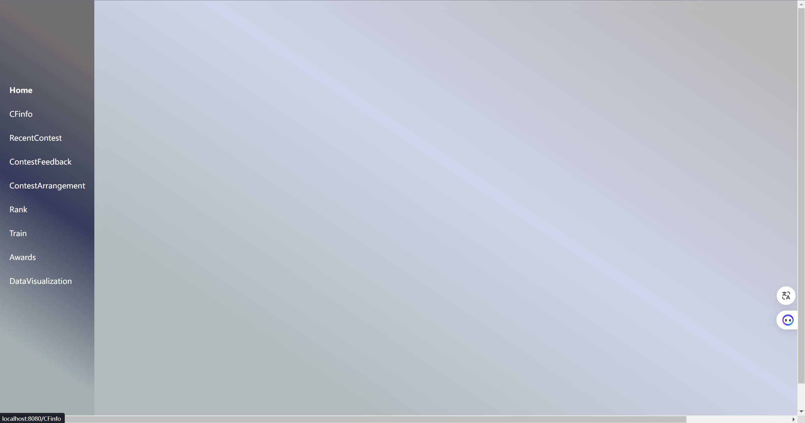

## Font End Dev log

2024.7.1
学习git控制
写网页端基础的仪表盘结构

2024.7.2
学习Element ui
完成首页学生信息表格的展示，实现分页与搜索功能

2024.7.3
学习Echarts
完成首页学生信息表的ratingHistor可视化

2024.7.4
完成codeforce 题库页面信息展示，分页，搜索功能

完成最近比赛页面信息展示，分页，搜索功能

完成比赛反馈页面信息展示，分页，搜索，为每一个比赛绑定填写问卷/查看结果选项
[alt text](image-8.png)
糊出竞赛日历表结构，暂未填入比赛数据
